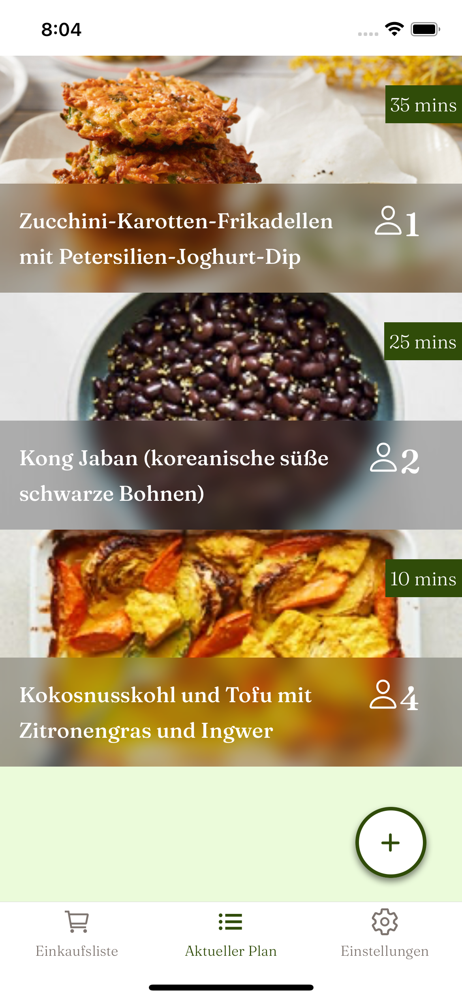

# Eatological - Frontend App with Expo and React Native



This is a [React Native](https://facebook.github.io/react-native/) app using the [Expo framework](https://expo.io) and written in [TypeScript](http://www.typescriptlang.org). With this app, users are able to create a meal plan that is particularly sustainable. A genetic algorithm is used for this, but it is not part of this repository.

## Prerequisites

- [Node.js](https://nodejs.org/).
- [Yarn](https://yarnpkg.com/).
- Optional: [XCode](https://developer.apple.com/xcode/), since it includes the iOS Simulator. XCode only runs on Macs.
- Optional: [Android Studio](https://developer.android.com/studio), since it includes the Android Virtual Device Manager.

You don't need to install any global npm packages for this repo. `expo-cli` is included as a dev dependency.

## Running the App

Install all necessary packages via yarn. 

```shell
yarn install
```

Start the local server. This will give you a QR code that you can scan using the Expo Client app on your mobile device.

```shell
yarn start
```

If you're on a Mac and have Xcode installed, you can run the app using the iOS Simulator with the following command. For android it's similar.

```shell
yarn ios
```

## Packages


| Package Name                     | Version | Notes                                            |
| -------------------------------- | ------ | ------------------------------------------------ |
| @expo-google-fonts/fraunces      | 0.2.2  | Used for the theming                             |
| @expo/webpack-config             | 0.17.3 |                                                  |
| @react-native-async-storage/async-storage          |    1.17.11    | Used to persist user data on the phone.     |
| @react-native-community/async-storage                     | 1.12.1  |                                                  |
| @react-navigation/native              | 6.1.0  | Used for navigation in the app.    |
| @reduxjs/toolkit | 1.9.1| Used for the redux store (global state) |
| @shopify/restyle | 2.1.0| Used to create a global theme (color, spacing, heights, text, etc.) |
| @types/react-dom | 18.0.9| |
| @types/react-native-vector-icons | 0.4.12| Icons |
| @types/react-native | 0.70.8| |
| @types/react-navigation | 3.4.0| |
| @types/react-redux | 7.1.24| |
| @types/react | 18.0.26| |
| @typescript-eslint/eslint-plugin | 5.45.1| |
| @typescript-eslint/parser | 5.45.1| |
| axios | 1.2.1| Used for all API requests |
| eslint-config-universe | 11.1.1| |
| eslint | 8.29.0| |
| expo-blur | 12.0.1| Blur component |
| expo-font | 11.0.1| |
| expo-status-bar | 1.4.2| |
| expo-updates | 0.15.6| |
| expo | 47.0.8| |
| prettier | 2.8.0| |
| react-dom | 18.1.0| |
| react-native-gesture-handler | 2.8.0| |
| react-native-safe-area-context | 4.4.1| |
| react-native-screens | 3.18.2| |
| react-native-step-indicator | 1.0.3| Used for Progress Indicator in SwapMeals |
| react-native-swipe-list-view | 3.2.9| Used for Swiping Functionality in SwapMeals |
| react-native-vector-icons | 9.2.0| |
| react-native-web | 0.18.10| |
| react-native | 0.70.5| |
| react-navigation | 4.4.4| |
| react-redux | 8.0.5| |
| react | 18.1.0| |
| redux-persist | 6.0.0| |
| rn-tooltip | 3.0.3| Used for the tooltips of the IngredientItems |
| typescript | 4.9.3| |

## Troubleshooting

If you have issues running the app it may help clearing the React Native packager cache. Use the command `yarn expo start --clear` to do this.

## Folder Structure

### ```pages```
 The ```pages``` folder should contain one folder for each page in the application. Inside of those page specific folders should be a single root file that is your page alongside all the files that are only applicable to that page. 

### ```components```
The ```components``` folder is currently broken down into two subfolders. These subfolders are really useful since they help keep the components organized into different sections instead of just being one massive blob of components. We have an ui folder which contains all our UI components like buttons, modals, cards, etc. We also have a form folder for form specific controls like checkboxes, inputs, date pickers, etc.

### ```assets```
The assets folder contains all images, css files, font files, etc. for the project. Pretty much anything that isn't code related will be stored in this folder.

### ```redux```
The redux folder stores all redux files that are used across multiple pages. In our project we use a Redux-Setup with Redux Toolkit. Therefore all files that are related to the Redux-Store (store, slices, actions) are saved here. 

### ```utils```
```utils```-folder contains our axios-setup, so everything we want to setup only once and use all over the project. 


# Coding conventions

Eslint and prettier aren’t configured by default; we configured it ourselves with the Expo-package named eslint-config-universe. 
